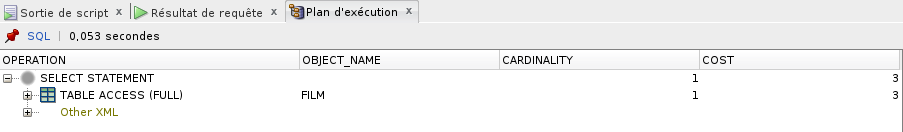
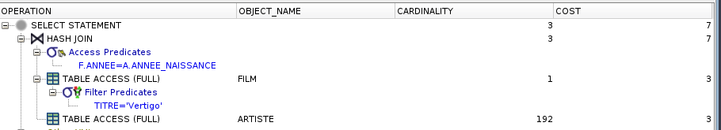

# TP2 - DOC
_13/11/2017_

## Plan d'éxecution

### 7.

### 8.
**TABLE ACCESS FULL** :

Cette opération est aussi connue sous le nom de parcours complet de table. Elle lit la table entière, toutes les lignes et toutes les colonnes, comme elle est stockée sur le disque. Bien que les opérations multi-blocs accélèrent fortement la rapidité d'un parcours complet de table, c'est l'une des opérations les plus coûteuses. En dehors de gros taux d'entrées/sorties, un parcours complet de table doit inspecter toutes les lignes de la table, donc il peut aussi consommer beaucoup de temps processeur.

### 9.

La stratégie utilisé pour cette requête est **HASH JOIN** :

La jointure de hachage charge les enregistrements candidats d'un côté de la jointure dans une table de hachage qui est ensuite sondée pour chaque ligne de l'autre côté de la jointure.

### References
http://use-the-index-luke.com/fr/sql/plans-dexecution/oracle/operations
